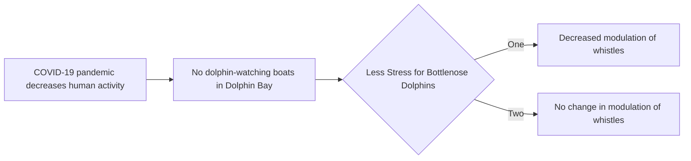

# Homework 4

## Emma Gagne

### All done in Typora

#### Unordered Lists

Unordered lists are denoted by the symbol '*' followed by your item.

* Item 1
* Item 2
    + Item 2a
    + Item 2b

##### Ordered Lists

Ordered lists are denoted by numbering followed by your item.

1. Item 1
2. Item 2
3. Item 3
    + Item 3a
    + Item 3b

###### yet another sub heading

### Manual line breaks

Manual line  
Breaks.

### Links

http://example.com

[linked phrase](http://example.com)

A [linked phrase][id]. 

### Images

#### Hand Drawn Flow Chart


#### Flow Chart from Software



### Block quotes

> Here is a quote by someone important.

### Plain code blocks

```
This is a box of literal  
plain text.  
Just like I **type it**.
```

### R code blocks

```(r)
# here is a comment
x <- 3
y <- 'character string'
```

### In line blocks

To create in line blocks simply `add a backtick` to show anything in plain text.

### In line LaTeX equation

In line LaTeX equation such as $\mathbf{x} = \mathbf{3} + \mathbf{4}$ uses '$' to wrap a TeX command.

### Centered LaTeX equation

$$
\mathbf{x}  =  \mathbf{3} + \mathbf{4}
$$

### Horizontal line

Add a horizontal line by typing three or more underscores in a single line.

___

### Simple table

| First Header  | Second Header |
| ------------- | ------------- |
| Content Cell  | Content Cell  |
| Content Cell  | Content Cell  |

### Text highlighting

You can highlight ==important words== using two equal signs before and after what you want to highlight. 

```

```